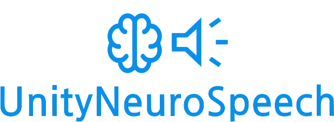

  

#

> **Make your Unity characters hear, think, and talk — using real voice AI. Locally. No cloud.**

---

UnityNeuroSpeech is a lightweight and open-source framework for creating **fully voice-interactive AI agents** inside Unity.  
It connects:

- 🧠 **Whisper** (STT) – converts your speech into text  
- 💬 **Ollama** (LLM) – generates smart responses  
- 🗣️ **XTTS** (TTS) – speaks back with *custom voice + emotions*

All locally. All offline.  
No subscriptions, no accounts, no OpenAI API keys.

---

## 🚀 What can you build with UnityNeuroSpeech?

- 🎮 AI characters that understand your voice and reply in real time  
- 🗿 NPCs with personality and memory  
- 🧪 Experiments in AI conversation and narrative design  
- 🕹️ Voice-driven gameplay mechanics  
- 🤖 Interactive bots with humanlike voice responses

---

## ✨ Core Features

| Feature | Description                                                                                |
|--------|--------------------------------------------------------------------------------------------|
| 🎙️ **Voice Input** | Uses [whisper.unity](https://github.com/Macoron/whisper.unity) for accurate speech-to-text |
| 🧠 **AI Brain (LLM)** | Easily connect to any local model via [Ollama](https://ollama.com)                         |
| 🗣️ **Custom TTS** | Supports any voice with [Coqui XTTS](https://github.com/coqui-ai/TTS)                      |
| 😄 **Emotions** | Emotion tags (`<happy>`, `<sad>`, etc.) parsed automatically from LLM                      |
| 🎛️ **Agent API** | Subscribe to events like `BeforeTTS()` or access `AgentState` directly                     |
| 🛠️ **Editor Tools** | Create, manage and customize agents inside Unity Editor                                    |
| 🧱 **No cloud** | All models and voice run locally on your machine                                           |
| 🌐 **Multilingual** | Works with over **15+ languages**, including English, Russian, Chinese, etc.               |

---

## 🧪 Built with:

- 🧠 [`Microsoft.Extensions.AI`](https://learn.microsoft.com/en-us/dotnet/ai/) (Ollama)
- 🎤 [`whisper.unity`](https://github.com/Macoron/whisper.unity)
- 🐍 [Python Flask server](server/) (for TTS)
- 🧊 [Coqui XTTS model](https://github.com/coqui-ai/TTS)
- 🤖 Unity 6

---

## 📚 Get Started

See [UnityNeuroSpeech official website](https://hardcodedev777.github.io/UnityNeuroSpeech/).

---

## 😎 Who made this?

UnityNeuroSpeech was created by [HardCodeDev](https://github.com/HardCodeDev777) —  
indie dev from Russia who just wanted to make AI talk in Unity.

---

## 🗒️ License

UnityNeuroSpeech is licensed under the **MIT License**.
For other Licenses, see [Licenses](docs/other/licenses.md).
